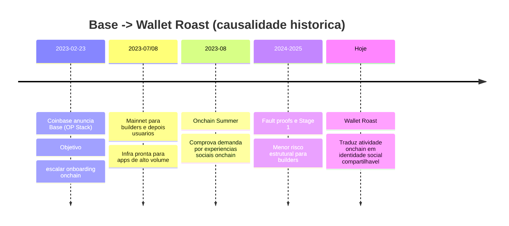
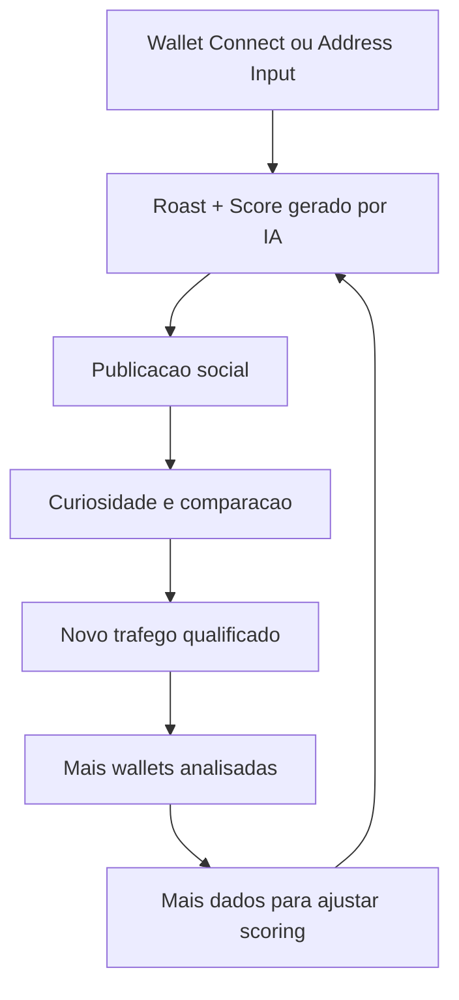

# Wallet Roast Na Base: Explicacao Tecnica, Logica E Historica

## Objetivo

Este documento explica por que um produto aparentemente simples como `neo-wallet-roast` faz sentido estrategico e tecnico quando conectado a Base.
A leitura parte de causalidade historica, passa por arquitetura de sistema e termina em implicacoes de produto.

## Tese

A Base nao e apenas uma L2 barata. Ela e um motor de distribuicao onchain com tres propriedades chave:

1. Custos baixos para microinteracoes
2. Infra de onboarding conectada ao ecossistema Coinbase
3. Narrativa cultural de massa sobre identidade onchain

Wallet Roast encaixa exatamente nessas tres propriedades.
Ele transforma dado onchain bruto em narrativa social compartilhavel com custo unitario baixo.

## Linha Do Tempo Historica E Causal

### Marco 1: Fundacao da Base

Em 23 de fevereiro de 2023, a Coinbase anunciou a Base como L2 sobre OP Stack com objetivo explicito de levar mais pessoas onchain.
Ponto causal: desde a origem, Base foi pensada como camada de aplicacao de alto volume, nao so como experimento de infraestrutura.

### Marco 2: Mainnet e Onchain Summer

Em 2023, o ciclo de lancamento para construtores e depois para usuarios abriu a fase de distribuicao cultural.
Onchain Summer consolidou a tese de que experiences leves, colecionaveis e social-first escalam mais rapido em Base.
Ponto causal: Base mostrou que crescimento onchain nao depende apenas de DeFi complexo. Depende de formatos culturais replicaveis.

### Marco 3: Decentralizacao progressiva

A Base reforcou a narrativa de descentralizacao gradual e publicou avancos para Stage 1 com fault proofs e governanca mais distribuida.
Ponto causal: previsibilidade de infraestrutura aumenta confianca de builders e reduz risco de lock-in institucional.

### Consequencia para este produto

Wallet Roast herda diretamente essa evolucao:

1. Usa UX de entrada quase zero friccao
2. Gera output narrativo com alto potencial de compartilhamento
3. Opera sobre stack compativel com Base e ecossistema Coinbase

## Diagrama 1: Evolucao Historica E Implicacoes



## Estado Tecnico Atual Do Projeto

Com base no codigo atual:

1. Frontend em Next.js 15 + React 19
2. Conexao de wallet via OnchainKit com `chain={base}`
3. Endpoint `POST /api/roast` usando OpenAI (`gpt-4o-mini`) para gerar JSON com roast, score e labels
4. Captura de dados de carteira via integracao Etherscan/Moralis com fallback demo

Resumo tecnico:
O app ja nasce com interface Base-first na camada de conexao.
A camada de dados ainda esta parcialmente Ethereum-first.

## Diagrama 2: Arquitetura De Execucao Atual

```mermaid
flowchart LR
  U[Usuario]
  C[HomeClient\nNext.js Client]
  W[OnchainKit Wallet\nchain = Base]
  A[/api/roast\nNext Route Handler]
  D[fetchWalletData\nEtherscan + Moralis]
  O[OpenAI Chat Completions\nresponse_format json_object]
  R[Roast JSON\nscore + labels]
  S[Share Intent\nX/Twitter]

  U --> C
  C --> W
  C -->|POST address/isDemo| A
  A --> D
  A --> O
  D --> A
  O --> A
  A --> R
  R --> C
  C --> S
```

## Logica Economica E De Produto

### Funil real

1. Entrada: endereco de wallet
2. Processamento: compressao semantica de dados onchain
3. Saida: score + roast com identidade publica
4. Distribuicao: compartilhamento social
5. Reentrada: novos usuarios testam suas carteiras

### Por que isso fecha na Base

1. Baixo custo por acao permite loop social frequente
2. Familiaridade de onboarding reduz atrito
3. Cultura creator-first da Base aumenta taxa de replicacao de conteudo

Wallet Roast nao depende de liquidez profunda, derivativos ou UX pesada.
Ele depende de latencia baixa, custo baixo e contexto social. Isso e exatamente o terreno da Base.

## Diagrama 3: Flywheel De Crescimento



## Gap Tecnico Para Alinhamento Total Com Base

Hoje o produto esta semanticamente ligado a Base na UX, mas pode subir um nivel no plano de dados:

1. Trocar coleta principal para fontes Base-native (indexer/API para Base, nao apenas Ethereum)
2. Incluir sinais especificos de Base no score:
   - interacao com apps de Base
   - custo medio por transacao em Base
   - frequencia de bridging para Base
3. Separar metricas por rede para evitar confundir comportamento Ethereum L1 com Base L2

## Proposta De Arquitetura Alvo

1. Camada de ingestao multichain com prioridade Base
2. Camada de features derivadas por rede
3. Camada de scoring versionado
4. Camada de narrativa com templates condicionais por perfil
5. Telemetria de conversao social para aprendizado continuo

Resultado esperado:
o sistema evolui de "roast divertido" para "motor de reputacao onchain orientado a Base".

## Conclusao

Historicamente, Base abriu a infraestrutura e a distribuicao cultural para produtos sociais onchain.
Tecnicamente, Wallet Roast usa uma arquitetura leve que captura essa oportunidade com eficiencia.
Estrategicamente, a simplicidade da implementacao nao e limitacao. E vantagem competitiva.

## Referencias Primarias

1. Coinbase Blog, Introducing Base (23 Feb 2023): https://www.coinbase.com/blog/introducing-base
2. Base Blog, Onchain Summer Highlights: https://blog.base.org/onchain-summer-highlights
3. Base Blog, Base has reached Stage 1 Decentralization: https://blog.base.org/base-has-reached-stage-1-decentralization
4. Base Docs, Differences between Ethereum and Base: https://docs.base.org/base-chain/network-information/diffs-ethereum-base
